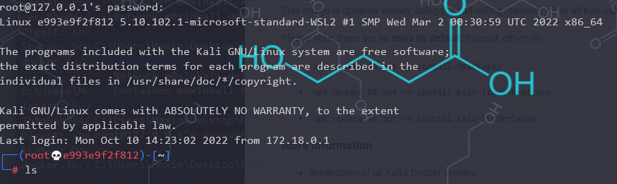

# 说明

基于kali官方开源的Docker镜像修改，如需使用官方固件可以前往https://hub.docker.com/r/kalilinux/kali-rolling

Docker Hub https://hub.docker.com/r/m0x1n/kali-rolling

Github https://github.com/Moxin1044/kali-linux-docker

Gitee https://gitee.com/Moxin1044/kali-linux-docker

构建于：`kalilinux/kali-rolling`

构建时间：2022年10月10日

博客地址：https://blog.easyctf.cn/Moxin/50834.html

https://www.cnblogs.com/M0x1n/p/Kali-Linux-for-Docker.html

构建内容：基于原系统版本中，增加了基础系统和SSH工具，做到即用即启。

SSH已设置自启动，默认命令行为Bash

以增加default环境包，包含了基础工具。

系统用户名和密码：root root

`docker pull m0x1n/kali-rolling:latest`

需要什么端口就用什么端口，ssh端口默认为22

`docker run -d -p 22:22 m0x1n/kali-rolling`

接着直接ssh连接即可

# 官方镜像

在我的仓库，也提供了官方镜像的部署，原因是为了构建方便

`docker pull m0x1n/kali-rolling:v1.0`

由于官方镜像没有开放端口，所以直接`docker run -d m0x1n/kali-rolling:v1.0即可`

接着`docker exec -it <容器ID> bash`即可进入命令行
